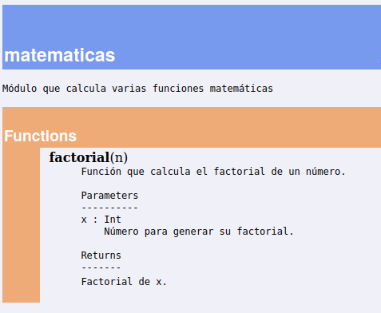

Práctica V. Estructuras de control de flujo
===========================================

En esta práctica vamos a trabajar con el control de flujo de ejecución a través de `if`, `while` y `for`. 

Documentación oficial útil
--------------------------

Estos son fragmentos y ejemplos de la documentación oficial que pueden ayudarte: 

* [4. Herramientas para el control de flujo](https://docs.python.org/es/3/tutorial/controlflow.html#if-statements): las secciones 4.1 a 4.3 explican `if`, `for` y `range` con ejemplos. 
* [3.2. Una introducción informal a Python](https://docs.python.org/es/3/tutorial/introduction.html#first-steps-towards-programming): Introduce `while` al final del capítulo con el ejemplo de cálculo de la serie de Fibonacci. Además, en 3.1 repasa Python como calculadora y manejo de cadenas. 

Cómo documentar código Python
-----------------------------

Python ofrece varias alternativas de documentación. Por un lado, en cualquier momento podemos introducir comentarios con el carácter `#`:

```python
def factorial(n):
    f = 1
    # range hasta n+1 para que considere el propio número 
    for i in range(1, n+1):
        f = f * i

    return f
```

Cada función puede documentarse con una cadena especial llamada [docstring](https://peps.python.org/pep-0257/). Esto nos permite realizar comentarios de varias líneas y, utilizando palabras clave, generar documentación formateada. 

Resumen `docstring`:
* Se indica con tres comillas simples o dobles para iniciar y para cerrar
* La primera línea/párrafo debe ser una descripción breve de la función.
* Los siguientes párrafos indican información adicional de funcionamiento, parámetros, ejemplos, etc. 
* Cada línea debe empezar en mayúscula y terminar en ..

Supongamos un fichero `matematicas.py`:
```python
def factorial(n):
    '''
    Función que calcula el factorial de un número.
    '''
    f = 1
    # range hasta n+1 para que considere el propio número 
    for i in range(1, n+1):
        f = f * i

    return f
```

```python
>>> from matematicas import factorial
>>> help(factorial)
factorial(n)
    Función que calcula el factorial de un número.
```

Adicionalmente podemos documentar para cada función sus parámetros de entrada, salida, gestión de errores, etc. La documentación del módulo se hace al principio del fichero, antes de declarar funciones. 

Cierra y abre el terminal de python: 

```python
'''
Módulo que calcula varias funciones matemáticas
'''

def factorial(n):
    '''
    Función que calcula el factorial de un número.

    Parameters
    ----------
    x : Int
        Número para generar su factorial. 

    Returns
    -------
    Factorial de x.
    '''
    f = 1
    # range hasta n+1 para que considere el propio número 
    for i in range(1, n+1):
        f = f * i

    return f
```


```python
>>>import matematicas
>>>help(matematicas)

Help on module matematicas:

NAME
    matematicas - Módulo que calcula varias funciones matemáticas

FUNCTIONS
    factorial(n)
        Función que calcula el factorial de un número.
        
        Parameters
        ----------
        x : Int
            Número para generar su factorial. 
        
        Returns
        -------
```

Cómo generar una web con documentación a partir de pydoc o epydoc

Si habéis instalado anaconda, desde el terminal esto general la web factorial.html que podés abrir con vuestro navegador. **NOTA: en este caso no ponemos la extensión .py**.

Debemos abrir el terminar en Linux o en Windows (con el programa Conda Prompt) en la carpeta de la práctica. Para ello puedes copiar la ruta pulsando `CTRL+L` en el navegador de archivos y poner `cd RUTA` y pulsar intro. A continuación puedes ejecutar lo siguiente: 

```
pydoc -w matematicas
```

Esto hay que repetirlo cuando hagáis cambios.

Os debería salir algo así: 


Alternativamente, con epydoc, desde los ordenadores de las aulas también podéis hacer. 

```
epydoc matematicas.py 
```
